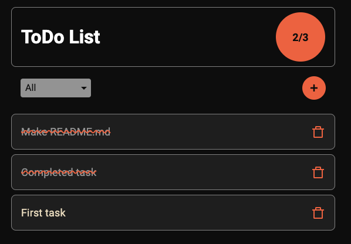

# ToDo List

### React + TypeScript + Vite

Creating and persist todo

App used localStorage to persist todos



#

### Installation

Clone repository:

```bash
$ git clone git@github.com:fondunn/todo.git
```

Install `node_modules`:

```bash
$ npm install
```

By default task chars limit - 50. To change this option add `.env` file in root folder.
Add variable `VITE_TASK_LENGTH_LIMIT=` with the right amount.

Example: `VITE_TASK_LENGTH_LIMIT=120`

#

### Run app

```bash
$ npm run dev
```

By default app runs on port: `5173`
